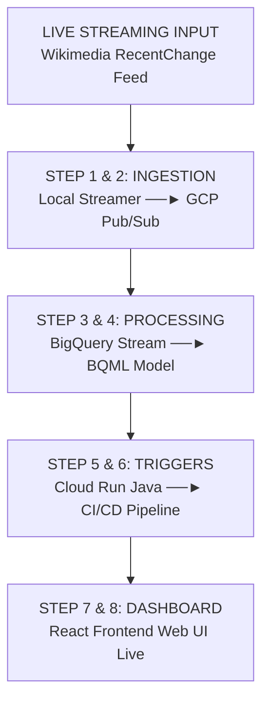

# Training Project Profile

## Internship Position
- **Title**: Data Science Intern – Streaming & Predictive Analytics
- **Business/Department**: Growth Marketing & Data Operations
- **Cloud Ecosystem**: Google Cloud Platform (GCP)

## Job Description (JD)
- **Agile Governance**: Participates in daily Scrum, sprint planning, and backlog refinement processes using active Agile methodologies. ==> Github Issue Board, create feature/story, Sprint Board
- **Streaming Ingestion**: Designs, implements, and maintains serverless data streaming pipelines using GCP Pub/Sub to intercept raw production message packets.
- **In-Flight Modeling**: Develops, scales, and validates real-time user intent and propensity classification models within Google BigQuery ML.
- **Pipeline CI/CD**: Builds, tests, and deploys streaming consumer container applications utilizing Google Cloud Run, Artifact Registry, and automated GitHub Actions workflows.
- **Real-Time Data Visualization**: Engineers real-time web monitoring architectures using React.js and active WebSockets to display streaming analytical feeds.
- **System Integrity**: Monitors latency, tracks data schema drift, and maintains zero-budget cloud pricing limits through Google Cloud Monitoring and budget alerts.

## Skills Required
- **Cloud Architecture**: 1+ years of academic or practical exposure to core cloud components (specifically GCP or AWS infrastructure).
- **Languages**: Strong foundational proficiency in Python (Pandas, Numpy, Scikit-Learn) and Java (Object-Oriented design patterns).
- **Data Pipelines & Web Engineering**: Basic knowledge of streaming structures, relational databases, SQL queries, HTML/CSS, and React.js.
- **DevOps & Tools**: Experience operating within Linux terminals, managing repositories with Git/GitHub, and working in IDEs like VS Code.
- **Problem Solving & Agile**: Strong analytical reasoning to fix data anomalies, debug cloud connections, and collaborate within strict Scrum sprint cycles.

## Learning Outcomes
- **Data Ingestion Engineering**: Architect and document low-latency, real-time message pipelines over production data streams.
- **Cloud ML Deployment**: Implement serverless, predictive machine learning classification scripts entirely inside scalable enterprise data warehouses.
- **DevOps Automatons**: Design operational CI/CD build scripts to automatically test, containerize, and push code alterations to production nodes under 3 minutes.
- **Full-Stack Syncing**: Bridge backend cloud intelligence with modern, responsive front-end user dashboards via secure WebSocket connections.
- **Professional Alignment**: Articulate data architecture logic clearly to multi-functional teams while respecting information compliance and strict cloud governance constraints.

## Architecture Overview

## Month 1: Streaming Ingestion & BigQuery Data Warehousing

### Step 1: Environment Setup & Local Stream Handlers (Week 1)
- Technical Plan: Set up a local development workspace using VS Code and a Linux shell. Authenticate the environment using the Google Cloud SDK (gcloud CLI). Write a Python script to consume real-time events from the live Wikimedia recentchange endpoint via Server-Sent Events (SSE).
- Evaluation Metric: The pipeline successfully prints structured JSON payloads to the local console without dropped connections or syntax exceptions during a continuous 10-minute runtime test.

### Step 2: GCP Pub/Sub Serverless Architecture (Week 2)
- Technical Plan: Provision a Google Cloud Pub/Sub topic named live-wikimedia-stream. Upgrade the Python streaming script to serialize incoming
